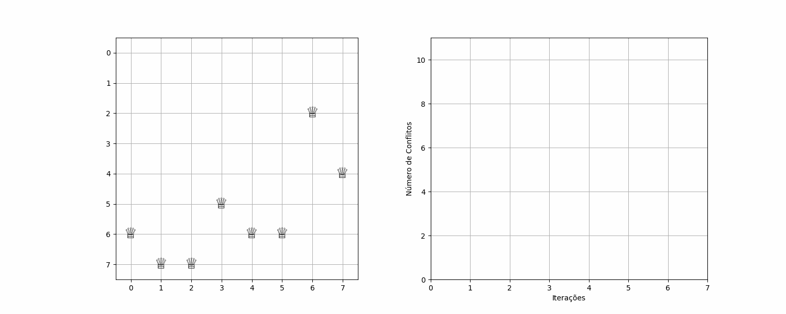
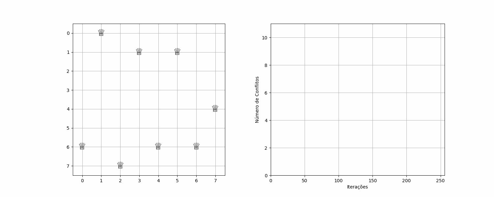

# heuristics-classes
[](https://www.python.org/)  [](https://en.wikipedia.org/wiki/Machine_learning)  [](https://en.wikipedia.org/wiki/Reinforcement_learning)  

Este repositório centraliza todas as atividades e classes ministradas por Telma Soares no Instituto de Informática (UFG).

## Atividades

### :chess_pawn: Atividade 1 - 8 Queens Problem

A primeira atividade trata do famoso problema das 8 Rainhas no tabuleiro de xadrez. O objetivo é posicionar 8 rainhas em um tabuleiro de xadrez 8x8 de forma que nenhuma rainha possa atacar outra.

#### Solução Implementada

Foram implementados dois algoritmos de busca local para resolver o problema:

1. **Hill Climbing**
   - Algoritmo que sempre move para o estado vizinho com menor número de conflitos
   - Pode ficar preso em mínimos locais
   - Implementação mais simples e rápida

2. **Simulated Annealing**
   - Algoritmo que permite movimentos para estados piores com uma probabilidade que diminui ao longo do tempo
   - Maior chance de escapar de mínimos locais
   - Implementação mais complexa mas com maior taxa de sucesso


#### Estrutura do Projeto

```
atividade1/
├── eight_queens.py     # Implementação dos algoritmos
├── experiments.py      # Script para executar experimentos e gerar estatísticas
└── requirements.txt    # Dependências do projeto
```

#### Como Executar

1. Instale as dependências:
```bash
pip install -r requirements.txt
```

2. Execute um exemplo único:
```bash
python atividade1/eight_queens.py
```

3. Execute os experimentos comparativos:
```bash
python atividade1/experiments.py
```

#### Resultados Esperados

1. **Visualização do Tabuleiro**
   - Ao executar `eight_queens.py`, serão exibidos:
     - Estado final do tabuleiro para cada algoritmo
     - Gráfico de convergência comparando os algoritmos
     - Número de conflitos e iterações para cada solução

2. **Análise Estatística**
   - Ao executar `experiments.py`, serão exibidos:
     - Taxa de sucesso de cada algoritmo
     - Média de iterações necessárias
     - Tempo médio de execução
     - Gráficos comparativos

## Grupo

- Carlos Henrique
- Francisco Gandala
- Kaiki Camilo
- Marcos Guilherme
- Pedro Saraiva

## Licença

Distribuído sob a licença MIT. Veja `LICENSE` para mais informações.
