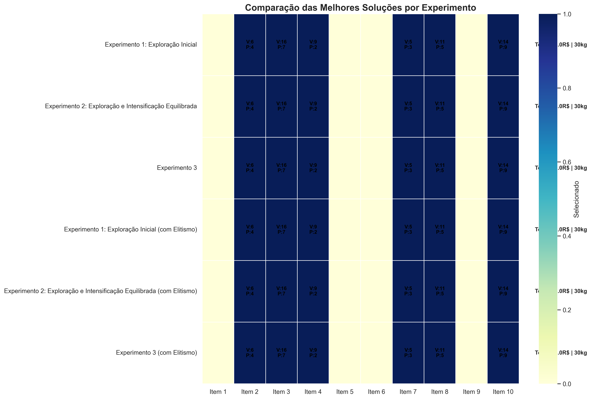

# heuristics-classes
[](https://www.python.org/)  [](https://en.wikipedia.org/wiki/Machine_learning)  [](https://en.wikipedia.org/wiki/Reinforcement_learning)  

Este repositório centraliza todas as atividades e classes ministradas por Telma Soares no Instituto de Informática (UFG).

## Atividades

### :chess_pawn: Atividade 1 - 8 Queens Problem

A primeira atividade trata do famoso problema das 8 Rainhas no tabuleiro de xadrez. O objetivo é posicionar 8 rainhas em um tabuleiro de xadrez 8x8 de forma que nenhuma rainha possa atacar outra.

#### Solução Implementada

Foram implementados dois algoritmos de busca local para resolver o problema:

1. **Hill Climbing**
   - Algoritmo que sempre move para o estado vizinho com menor número de conflitos
   - Pode ficar preso em mínimos locais
   - Implementação mais simples e rápida

2. **Simulated Annealing**
   - Algoritmo que permite movimentos para estados piores com uma probabilidade que diminui ao longo do tempo
   - Maior chance de escapar de mínimos locais
   - Implementação mais complexa mas com maior taxa de sucesso


#### Estrutura do Projeto

```
atividade1/
├── eight_queens.py     # Implementação dos algoritmos
├── experiments.py      # Script para executar experimentos e gerar estatísticas
└── requirements.txt    # Dependências do projeto
```

#### Como Executar

1. Instale as dependências:
```bash
pip install -r requirements.txt
```

2. Execute um exemplo único:
```bash
python atividade1/eight_queens.py
```

3. Execute os experimentos comparativos:
```bash
python atividade1/experiments.py
```

#### Resultados Esperados

1. **Visualização do Tabuleiro**
   - Ao executar `eight_queens.py`, serão exibidos:
     - Estado final do tabuleiro para cada algoritmo
     - Gráfico de convergência comparando os algoritmos
     - Número de conflitos e iterações para cada solução

2. **Análise Estatística**
   - Ao executar `experiments.py`, serão exibidos:
     - Taxa de sucesso de cada algoritmo
     - Média de iterações necessárias
     - Tempo médio de execução
     - Gráficos comparativos

### :package: Atividade 4 - Problema da Mochila com Algoritmo Genético

A quarta atividade aborda o clássico Problema da Mochila (Knapsack Problem) utilizando um Algoritmo Genético implementado com a biblioteca MEALPY. O objetivo é selecionar itens com diferentes pesos e valores para maximizar o valor total sem exceder a capacidade da mochila.

#### Solução Implementada

Implementação de um algoritmo genético utilizando MEALPY com:

- **Representação binária**: Cada item é representado por um bit (0 ou 1)
- **Seleção por torneio**: Método de seleção de indivíduos para reprodução
- **Experimentação com diferentes parâmetros**: Taxa de mutação, crossover e tamanho da população
- **Análise de elitismo**: Comparação entre execuções com e sem preservação dos melhores indivíduos




### Atividade 5 - Particle Swarm Optimization e Genetic Algorithms

**Função f1 (High Conditioned Elliptic):**


* **GA:** Convergência rápida, sensível à população. Exploração inicial boa, mas explotação precoce leva à estagnação.
* **PSO:** Convergência muito rápida, melhor resultado com configuração intermediária. Exploração inicial eficiente, mas também explotação precoce.
* **Comparação:** PSO converge mais rápido inicialmente. Ambos perdem diversidade cedo, limitando a otimização.

**Função f6 (Shifted and Rotated Weierstrass):**


* **GA:** Convergência rápida para mínimos locais devido à exploração limitada. Aumentar recursos traz pouca melhora.
* **PSO:** Similar ao GA, converge rápido para mínimos locais. Mais recursos ajudam marginalmente, mas exploração continua insuficiente.
* **Comparação:** Comportamento similar, ambos lutam com a multimodalidade pela perda rápida de exploração.

**Avaliação Crítica Geral:**

* Ambos (GA e PSO) sofrem de convergência prematura e exploração limitada nas funções complexas.
* Desempenho dependente da configuração dos parâmetros.
* Para f1, PSO teve convergência inicial mais rápida.
* Para f6, nenhum dos dois otimizou bem devido à dificuldade em escapar de mínimos locais.

**Comparação com Outros Algoritmos Evolucionários:**

Algoritmos com niching ou adaptação de parâmetros seriam mais adequados para funções multimodais. A falta de manutenção de diversidade é uma limitação chave do GA e PSO aqui.


#### Estrutura do Projeto

```
atividade4/
├── main.py            # Implementação principal do algoritmo genético
├── visualizations/    # Visualizações e gráficos gerados
└── README.md          # Descrição detalhada da atividade
```

#### Como Executar

1. Instale as dependências:
```bash
pip install numpy pandas matplotlib seaborn mealpy rich
```

2. Execute o algoritmo:
```bash
python atividade4/main.py
```

## Grupo

- Carlos Henrique
- Francisco Gandala
- Kaiki Camilo
- Marcos Guilherme
- Pedro Saraiva

## Licença

Distribuído sob a licença MIT. Veja `LICENSE` para mais informações.
