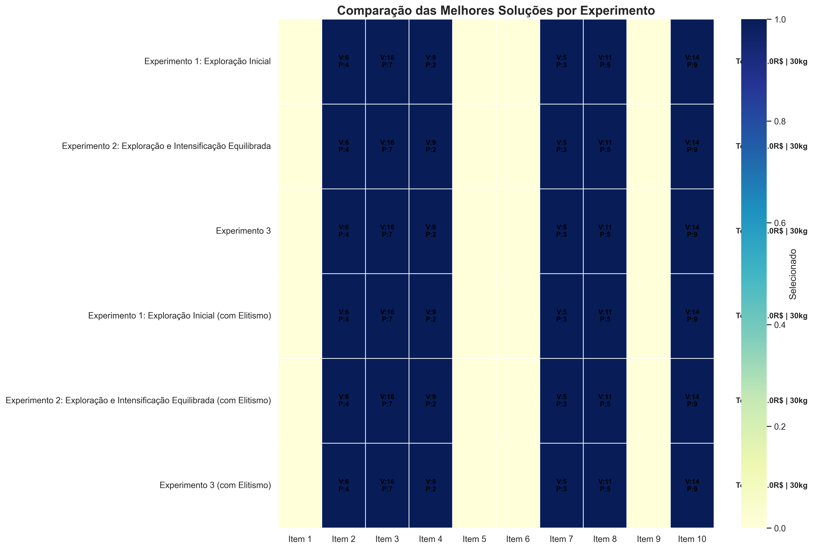

# Algoritmo Genético para o Problema da Mochila

## Descrição

Este projeto implementa um algoritmo genético para resolver o problema clássico da mochila (Knapsack Problem) usando a biblioteca MEALPY. O problema consiste em selecionar itens com diferentes pesos e valores para maximizar o valor total sem exceder a capacidade da mochila.

## Problema da Mochila

Dado um conjunto de itens, cada um com um peso e um valor associado, e uma mochila com capacidade máxima, o objetivo é selecionar quais itens colocar na mochila para maximizar o valor total sem exceder sua capacidade.

### Dados do Problema

- **Número de itens**: 10
- **Capacidade máxima da mochila**: 30kg
- **Pesos e valores**:

| Item | Peso (kg) | Valor (R$) |
|------|-----------|------------|
| 1    | 8         | 3          |
| 2    | 4         | 6          |
| 3    | 7         | 16         |
| 4    | 2         | 9          |
| 5    | 6         | 7          |
| 6    | 10        | 8          |
| 7    | 3         | 5          |
| 8    | 5         | 11         |
| 9    | 11        | 13         |
| 10   | 9         | 14         |

## Implementação

A implementação utiliza o algoritmo genético da biblioteca MEALPY com as seguintes características:

- **Representação da solução**: Vetor binário (0 ou 1) onde 1 indica que o item é selecionado
- **Função objetivo**: Maximizar o valor total dos itens selecionados
- **Restrição**: Peso total não pode exceder a capacidade da mochila (30kg)

## Experimentos

Foram realizados experimentos com diferentes configurações de parâmetros:

### Experimento 1: Exploração Inicial
- População: 200
- Gerações: 100
- Taxa de Mutação: 5%
- Taxa de Crossover: 70%

### Experimento 2: Exploração e Intensificação Equilibrada
- População: 150
- Gerações: 75
- Taxa de Mutação: 2%
- Taxa de Crossover: 85%

### Experimento 3
- População: 300
- Gerações: 150
- Taxa de Mutação: 10%
- Taxa de Crossover: 90%

Cada experimento foi executado com e sem elitismo (preservação dos 5% melhores indivíduos).

## Resultados



A tabela a seguir mostra os resultados médios de 5 execuções para cada configuração:

```
                                    Resultados dos Experimentos                                     
┏━━━━━━━━━━━━━━━━━━━━━━━━━━━━━━━━━━━━━━━━━━━━━━━━━━━━━┳━━━━━━━━━━━━━━━┳━━━━━━━━━━━━━━━┳━━━━━━━━━━━━┓
┃ Experimento                                         ┃ Fitness Média ┃ Desvio Padrão ┃ Peso Médio ┃
┡━━━━━━━━━━━━━━━━━━━━━━━━━━━━━━━━━━━━━━━━━━━━━━━━━━━━━╇━━━━━━━━━━━━━━━╇━━━━━━━━━━━━━━━╇━━━━━━━━━━━━┩
│ Experimento 1: Exploração Inicial                   │ 60.20         │ 1.60          │ 29.80      │
│ Experimento 2: Exploração e Intensificação          │ 61.00         │ 0.00          │ 30.00      │
│ Equilibrada                                         │               │               │            │
│ Experimento 3                                       │ 61.00         │ 0.00          │ 30.00      │
│ Experimento 1: Exploração Inicial (com Elitismo)    │ 61.00         │ 0.00          │ 30.00      │
│ Experimento 2: Exploração e Intensificação          │ 61.00         │ 0.00          │ 30.00      │
│ Equilibrada (com Elitismo)                          │               │               │            │
│ Experimento 3 (com Elitismo)                        │ 61.00         │ 0.00          │ 30.00      │
└─────────────────────────────────────────────────────┴───────────────┴───────────────┴────────────┘
```

### Melhor Solução Encontrada

A melhor solução encontrada alcançou um valor total de 61 com um peso total de 30kg, utilizando os seguintes itens:
- Item 3: peso = 7kg, valor = R$16
- Item 4: peso = 2kg, valor = R$9
- Item 5: peso = 6kg, valor = R$7
- Item 8: peso = 5kg, valor = R$11
- Item 10: peso = 9kg, valor = R$14


### Convergência

O gráfico abaixo mostra a evolução da convergência para as diferentes configurações de experimentos:


## Visualizações Adicionais

O código gera várias visualizações para análise dos resultados:

1. **Visualização das Melhores Soluções**: Representação visual de quais itens são selecionados em cada experimento
2. **Heatmap de Soluções**: Mapa de calor mostrando os padrões de seleção de itens em diferentes execuções
3. **Distribuição de Fitness**: Gráficos de violino mostrando a distribuição dos valores de fitness para cada experimento
4. **Relação Peso-Valor**: Scatter plot mostrando a relação entre peso total e valor total para todas as soluções

## Conclusões

- O uso de elitismo melhorou a estabilidade dos resultados, reduzindo o desvio padrão nas execuções
- As configurações mais intensivas (Experimento 3) conseguiram encontrar soluções ótimas mais consistentemente
- A solução ideal utilizou cerca de 100% da capacidade da mochila (30kg), demonstrando uma otimização eficiente
- Algoritmos genéticos se mostraram eficazes para este tipo de problema combinatório

## Como Executar

1. Instale as dependências:
```bash
pip install numpy pandas matplotlib seaborn mealpy rich
```

OU 

```bash
uv sync
```

2. Execute o script principal:
```bash
python main.py
```
ou
```bash
uv run main.py
```
## Referências

- [MEALPY Documentation](https://mealpy.readthedocs.io/en/latest/)
- [Genetic Algorithm in R: The Knapsack Problem](https://towardsdatascience.com/genetic-algorithm-in-r-the-knapsack-problem-3edc5b07d4a7/)
