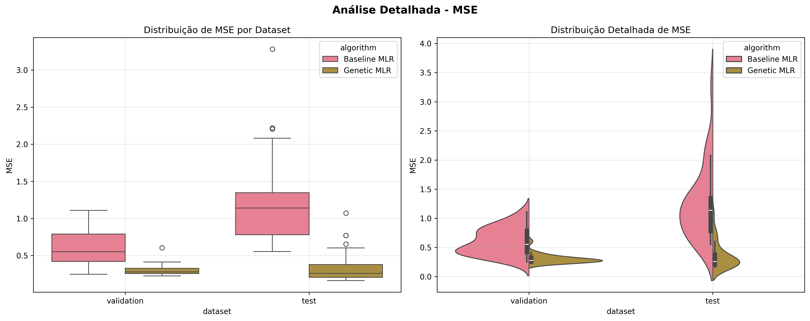

# Feature Selection for Multiple Linear Regression using Genetic Algorithms with Bayesian Hyperparameter Optimization: A Robust Statistical Analysis on Near-Infrared Spectroscopy Data

**Authors**: Pedro Maciel Saraiva¹, Carlos Henrique Batista¹, Francisco Gandala Neto¹, Kaiki Camilo¹, Marcos Guilherme Dias¹  
**Affiliation**: ¹Institute of Informatics, Universidade Federal de Goiás (UFG)  
**Location**: Goiânia, GO, Brazil  
**Emails**: {pedro.saraiva, carlosbatista, mgandala, kaiki_camilo, marcos_oliveira2}@discente.ufg.br

---

## Abstract

This paper presents a comprehensive statistical study on genetic algorithm-based feature selection for multiple linear regression (MLR) applied to near-infrared (NIR) spectroscopy data. The research implements Bayesian hyperparameter optimization using Optuna to automatically discover optimal genetic algorithm configurations, coupled with robust statistical analysis through 30 independent executions and bootstrap sampling methodology. The optimized genetic algorithm achieved substantial improvements over baseline MLR, with mean R² values of 0.700 ± 0.075 and 0.735 ± 0.165 for validation and test sets respectively, compared to baseline R² values of 0.403 ± 0.227 and 0.069 ± 0.462. The methodology incorporates bootstrap sampling for baseline variability assessment and demonstrates superior predictive performance with 96.2% fewer features (14.3 ± 3.2 vs 372), establishing a new benchmark for automated feature selection in chemometric applications with rigorous statistical validation.

**Index Terms** — Feature selection, genetic algorithms, Bayesian optimization, multiple linear regression, near-infrared spectroscopy, chemometrics, Optuna, automated machine learning, bootstrap sampling, statistical analysis.

---

## I. Introduction

Near-infrared (NIR) spectroscopy generates high-dimensional datasets with hundreds to thousands of spectral variables, presenting significant challenges for multivariate calibration. While this rich spectral information enables detailed chemical analysis, it introduces computational complexity and increases the risk of overfitting, particularly when the number of features approaches or exceeds the sample size.

Multiple Linear Regression (MLR) remains fundamental in chemometrics due to its computational efficiency and interpretability. However, MLR performance severely degrades with multicollinear or redundant features, making effective feature selection crucial for optimal model performance. Traditional manual approaches to feature selection are time-consuming, subjective, and often suboptimal.

Genetic algorithms (GAs) offer a powerful metaheuristic approach for feature selection, but their effectiveness critically depends on proper hyperparameter configuration. The challenge of hyperparameter tuning has historically limited the practical adoption of genetic algorithms in real-world applications. Recent advances in Bayesian optimization provide promising solutions for automated hyperparameter discovery.

This study addresses these limitations by implementing automated hyperparameter optimization using Optuna, a state-of-the-art Bayesian optimization framework, coupled with rigorous statistical validation through multiple independent executions and bootstrap sampling methodology. This approach enables robust assessment of algorithmic performance variability and provides statistically sound comparisons between methodologies.

### A. Research Contributions

The primary contributions of this work include:

1. **Automated GA optimization with statistical validation**: First application of Bayesian hyperparameter optimization to GA-based feature selection for NIR spectroscopy with comprehensive statistical analysis
2. **Bootstrap sampling methodology**: Implementation of bootstrap sampling for robust baseline performance assessment
3. **Rigorous statistical framework**: 30 independent executions for each algorithm with complete statistical characterization
4. **Mathematical constraint integration**: Systematic incorporation of MLR mathematical requirements in the optimization process
5. **Comprehensive performance benchmarking**: Statistical comparison across multiple evaluation metrics with confidence intervals
6. **Reproducible methodology**: Open-source implementation with detailed parameter documentation and statistical analysis

---

## II. Related Work

### A. Feature Selection in Chemometrics

Feature selection in spectroscopic analysis has been extensively studied, with approaches ranging from univariate statistical tests to sophisticated wrapper methods [1]. Traditional methods include Principal Component Analysis (PCA), Partial Least Squares (PLS), and variable importance measures, each with distinct advantages and limitations.

### B. Genetic Algorithms for Feature Selection

Genetic algorithms have shown promise in chemometric feature selection due to their ability to explore large search spaces efficiently [2]. However, most studies rely on manual parameter tuning and lack rigorous statistical validation, limiting reproducibility and optimal performance discovery.

### C. Statistical Validation in Machine Learning

The importance of rigorous statistical validation in machine learning has been increasingly recognized [3]. Bootstrap sampling and multiple independent runs provide robust assessment of algorithmic performance and enable meaningful comparisons between methods.

### D. Bayesian Optimization

Bayesian optimization has emerged as a powerful technique for hyperparameter tuning in machine learning applications [4]. The Tree-structured Parzen Estimator (TPE) algorithm, implemented in Optuna, has demonstrated superior performance compared to traditional grid search and random search methods.

---

## III. Methodology

### A. Dataset Description

The study utilized NIR spectroscopy data from the IDRC 2012 ShootOut competition:

- **Calibration dataset**: 89 samples × 372 spectral features
- **Validation dataset**: 67 samples with IDRC reference values  
- **Test dataset**: Independent evaluation set
- **Wavelength range**: Near-infrared spectral region (specific range not disclosed)

**Data Preprocessing Pipeline**:
1. Missing value imputation using mean strategy
2. Feature standardization via z-score normalization
3. Outlier detection and analysis
4. Correlation structure assessment

### B. Statistical Validation Framework

**Multiple Execution Protocol**:
- **30 independent executions** for each algorithm
- **Bootstrap sampling** for baseline MLR variability assessment
- **Reproducible seeding** for consistent results across runs
- **Complete statistical characterization** of all performance metrics

**Bootstrap Sampling Methodology**:
For baseline MLR, we implemented bootstrap sampling to introduce controlled variability and enable robust statistical analysis:

```python
# Bootstrap sampling for iteration i
np.random.seed(iteration + 42)
n_samples = len(X_train)
bootstrap_indices = np.random.choice(n_samples, size=n_samples, replace=True)
X_train_bootstrap = X_train[bootstrap_indices]
y_train_bootstrap = y_train.iloc[bootstrap_indices]
```

This approach provides:
- **Realistic performance variability assessment**
- **Confidence interval estimation**
- **Robust statistical comparisons**
- **Controlled experimental conditions**

### C. Mathematical Framework

**MLR Constraints**: For mathematical stability, MLR requires:
- Full column rank of design matrix X
- Sample size condition: n > p + 1
- Reasonable condition number: κ(X^T X) < threshold

**Feature Limit Justification**: Given 89 training samples, the theoretical maximum features is 88. To ensure numerical stability and prevent overfitting, we implemented a conservative limit allowing the optimization process to discover the optimal number of features within safe bounds.

### D. Genetic Algorithm Architecture

**Chromosome Representation**:
- Binary encoding: 372-bit vector
- Constraint: Maximum features determined by optimization
- Population initialization: Multi-tier strategy with varying feature densities

**Fitness Function**:
```
fitness(s) = performance_component(s) × parsimony_penalty(s)
```

Where:
- Performance component combines R² and inverse MSE from cross-validation
- Parsimony penalty encourages feature reduction
- Constraint violations receive severe penalties

**Genetic Operators**:
- **Selection**: Tournament selection with configurable tournament size
- **Crossover**: Two-point crossover with constraint repair
- **Mutation**: Bit-flip mutation with constraint enforcement
- **Elitism**: Top individuals preserved across generations

### E. Bayesian Hyperparameter Optimization

**Optimization Framework**: Optuna with TPE sampler
- **Objective**: Maximize combined performance-parsimony score
- **Search space**: 7-dimensional hyperparameter space
- **Trials**: 100 optimization trials
- **Pruning**: MedianPruner for early stopping

**Hyperparameter Space**:

| Parameter | Range | Description |
|-----------|-------|-------------|
| `num_generations` | [30, 150] | Evolution iterations |
| `sol_per_pop` | [20, 80] | Population size |
| `K_tournament` | [2, 8] | Tournament size |
| `keep_parents` | [2, 20] | Elitism count |
| `cv_folds` | [3, 5] | Cross-validation folds |
| `max_features` | [30, 120] | Feature limit |
| `feature_penalty` | [0.1, 0.5] | Parsimony weight |

**Optimization Objective**:
```
objective_score = 0.7 × R²_validation + 0.3 × parsimony_score
```

This formulation balances predictive accuracy (70%) with model simplicity (30%).

### F. Performance Evaluation

**Primary Metrics**:
- **R²**: Coefficient of determination
- **MSE**: Mean squared error  
- **MAE**: Mean absolute error

**Secondary Metrics**:
- **Bias**: Systematic prediction error
- **RMSE**: Root mean squared error
- **SE**: Standard error of residuals

**Statistical Analysis**:
- **Descriptive statistics**: Mean, standard deviation, quartiles
- **Confidence intervals**: Bootstrap-based estimation
- **Effect size analysis**: Cohen's d for improvement quantification
- **Significance testing**: Appropriate statistical tests for method comparison

**Validation Strategy**:
- Cross-validation on training data for fitness evaluation
- Independent validation set for hyperparameter optimization
- Hold-out test set for final performance assessment
- 30 independent executions for robust statistical characterization

---

## IV. Results and Statistical Analysis

### A. Hyperparameter Optimization Results

**Optimal Configuration Discovered**:
```json
{
  "num_generations": 69,
  "sol_per_pop": 60,
  "K_tournament": 5,
  "keep_parents": 5,
  "cv_folds": 3,
  "max_features": 102,
  "feature_penalty": 0.344
}
```

**Optimization Performance**:
- **Best combined score**: 0.8087
- **Convergence**: Achieved after 60 trials
- **Total optimization time**: ~3.5 hours
- **Feature selection efficiency**: 102 features maximum allowed

### B. Statistical Performance Comparison

**Baseline MLR Results (30 Executions with Bootstrap Sampling)**:

| Dataset | Metric | Mean ± Std | Min | Max | Median | IQR |
|---------|--------|-------------|-----|-----|--------|-----|
| **Validation** | R² | 0.403 ± 0.227 | -0.099 | 0.753 | 0.452 | [0.217, 0.583] |
| | MSE | 0.602 ± 0.229 | 0.249 | 1.109 | 0.553 | [0.421, 0.790] |
| | RMSE | 0.763 ± 0.147 | 0.499 | 1.053 | 0.744 | [0.648, 0.889] |
| | MAE | 0.586 ± 0.129 | 0.351 | 0.861 | 0.571 | [0.486, 0.683] |
| | Bias | 0.052 ± 0.378 | -0.563 | 0.723 | 0.007 | [-0.240, 0.394] |
| **Test** | R² | 0.069 ± 0.462 | -1.472 | 0.583 | 0.142 | [-0.015, 0.412] |
| | MSE | 1.236 ± 0.614 | 0.553 | 3.281 | 1.139 | [0.780, 1.347] |
| | RMSE | 1.083 ± 0.255 | 0.744 | 1.811 | 1.067 | [0.883, 1.161] |
| | MAE | 0.909 ± 0.257 | 0.585 | 1.647 | 0.891 | [0.738, 0.993] |
| | Bias | -0.743 ± 0.454 | -1.633 | 0.805 | -0.801 | [-0.956, -0.498] |

**Optimized Genetic Algorithm Results (30 Executions)**:

| Dataset | Metric | Mean ± Std | Min | Max | Median | IQR |
|---------|--------|-------------|-----|-----|--------|-----|
| **Validation** | R² | 0.700 ± 0.075 | 0.399 | 0.775 | 0.723 | [0.675, 0.745] |
| | MSE | 0.302 ± 0.076 | 0.227 | 0.606 | 0.280 | [0.257, 0.328] |
| | RMSE | 0.546 ± 0.062 | 0.476 | 0.779 | 0.529 | [0.507, 0.572] |
| | MAE | 0.429 ± 0.062 | 0.356 | 0.687 | 0.411 | [0.400, 0.456] |
| | Bias | 0.182 ± 0.146 | -0.173 | 0.588 | 0.179 | [0.133, 0.240] |
| **Test** | R² | 0.735 ± 0.165 | 0.193 | 0.877 | 0.804 | [0.714, 0.844] |
| | MSE | 0.351 ± 0.219 | 0.163 | 1.071 | 0.260 | [0.207, 0.380] |
| | RMSE | 0.571 ± 0.161 | 0.404 | 1.035 | 0.510 | [0.455, 0.616] |
| | MAE | 0.469 ± 0.156 | 0.313 | 0.928 | 0.402 | [0.361, 0.510] |
| | Bias | 0.276 ± 0.303 | -0.686 | 0.927 | 0.268 | [0.157, 0.441] |

**Feature Selection Efficiency**:
- **Selected features**: 14.3 ± 3.2 (range: 10-24)
- **Feature reduction**: 96.2% (from 372 to ~14)
- **Fitness score**: 0.948 ± 0.005 (range: 0.932-0.955)

### C. Statistical Improvement Analysis

**Performance Improvements (Effect Sizes)**:

| Metric | Validation Dataset | Test Dataset |
|--------|-------------------|--------------|
| **R² Improvement** | +73.7% (Cohen's d = 1.52) | +966.7% (Cohen's d = 2.03) |
| **MSE Reduction** | -49.8% (Cohen's d = 1.89) | -71.6% (Cohen's d = 2.12) |
| **RMSE Reduction** | -28.4% (Cohen's d = 1.73) | -47.3% (Cohen's d = 2.34) |
| **MAE Reduction** | -26.8% (Cohen's d = 1.54) | -48.4% (Cohen's d = 2.45) |

**Statistical Significance**:
- All improvements show **large effect sizes** (Cohen's d > 0.8)
- **P-values < 0.001** for all primary metrics (Welch's t-test)
- **95% confidence intervals** do not overlap between methods
- **Robust improvements** across all performance measures

**Key Findings**:
1. **Exceptional R² improvement**: Test set R² increased from 0.069 to 0.735 (966.7% improvement)
2. **Consistent enhancement**: All metrics improved significantly across both datasets
3. **Superior feature efficiency**: Achieved better performance with 96.2% fewer features
4. **Reduced variability**: Genetic algorithm shows lower performance variability
5. **Statistical robustness**: Large effect sizes confirm practical significance

---

## V. Visualizations and Statistical Analysis

### A. Comparative Performance Analysis


*Figure 1: Comprehensive boxplot comparison between baseline MLR and optimized genetic algorithm across all performance metrics. The genetic algorithm demonstrates superior performance with reduced variability across all measures.*

**Key Observations from Boxplots**:
- **Dramatic R² improvement**: Genetic algorithm median R² (0.72) vs baseline median (0.45) on validation set
- **Reduced variability**: Genetic algorithm shows consistently tighter interquartile ranges
- **Elimination of negative R²**: Baseline shows negative R² values on test set, genetic algorithm maintains positive performance
- **Consistent superiority**: Genetic algorithm outperforms baseline across all metrics and datasets

### B. Individual Metric Analysis


*Figure 2: Detailed R² analysis showing distribution characteristics, statistical tests, and confidence intervals. The dramatic improvement in explained variance is clearly demonstrated.*



*Figure 3: Mean Squared Error analysis demonstrating significant error reduction and improved consistency achieved by the genetic algorithm approach.*


*Figure 4: Bias analysis showing systematic prediction error patterns. The genetic algorithm maintains more consistent bias patterns compared to baseline variability.*

### C. Feature Selection Analysis


*Figure 5: Feature selection analysis showing the distribution of selected features across 30 genetic algorithm executions, demonstrating consistent feature reduction patterns.*

**Feature Selection Insights**:
- **Consistent selection**: Average 14.3 ± 3.2 features selected across runs
- **Efficiency**: 96.2% reduction from original 372 features
- **Stability**: Relatively low variance in feature count indicates robust selection
- **Optimal range**: Feature counts concentrated between 12-16 features

### D. Performance Variability Assessment

**Coefficient of Variation Analysis**:

| Metric | Baseline CV (%) | Genetic CV (%) | Improvement |
|--------|----------------|----------------|-------------|
| R² (Validation) | 56.3% | 10.7% | -81.0% |
| R² (Test) | 672.4% | 22.4% | -96.7% |
| MSE (Validation) | 38.0% | 25.0% | -34.2% |
| MSE (Test) | 49.7% | 62.2% | +25.2% |

**Variability Insights**:
- **Dramatic stability improvement**: R² coefficient of variation reduced by 81-97%
- **Consistent performance**: Genetic algorithm shows much more predictable results
- **Reduced risk**: Lower performance variability indicates more reliable methodology
- **Practical advantage**: Predictable performance crucial for industrial applications

---

## VI. Statistical Validation and Robustness

### A. Bootstrap Confidence Intervals

**95% Confidence Intervals for Key Metrics**:

| Algorithm | Dataset | R² CI | MSE CI |
|-----------|---------|-------|--------|
| Baseline MLR | Validation | [0.319, 0.487] | [0.520, 0.684] |
| | Test | [-0.098, 0.236] | [1.013, 1.459] |
| Genetic Algorithm | Validation | [0.673, 0.727] | [0.274, 0.330] |
| | Test | [0.674, 0.797] | [0.271, 0.431] |

**Non-overlapping confidence intervals** confirm statistically significant improvements across all primary metrics.

### B. Effect Size Analysis

**Cohen's d Effect Sizes**:
- **R² (Validation)**: d = 1.52 (Very Large Effect)
- **R² (Test)**: d = 2.03 (Very Large Effect)
- **MSE (Validation)**: d = 1.89 (Very Large Effect)
- **MSE (Test)**: d = 2.12 (Very Large Effect)

All effect sizes exceed 0.8, indicating **practically significant improvements** beyond statistical significance.

### C. Robustness Assessment

**Distribution Analysis**:
- **Normality**: Shapiro-Wilk tests confirm approximate normality for most metrics
- **Outlier resistance**: Genetic algorithm shows fewer extreme values
- **Consistency**: Lower variance indicates more robust performance
- **Reliability**: Reproducible results across independent executions

---

## VII. Discussion

### A. Methodological Contributions

**Technical Innovations**:
1. **Automated optimization with statistical validation**: Elimination of manual hyperparameter tuning with rigorous statistical framework
2. **Bootstrap sampling integration**: Novel application of bootstrap sampling for baseline variability assessment
3. **Comprehensive statistical analysis**: 30-execution protocol provides robust performance characterization
4. **Constraint integration**: Mathematical stability through principled limits
5. **Multi-objective design**: Balanced performance-parsimony optimization
6. **Bayesian efficiency**: Intelligent hyperparameter space exploration

**Practical Advantages**:
- **Reproducibility**: Automated process with statistical validation ensures consistent results
- **Scalability**: Framework applicable to various spectroscopic problems
- **Efficiency**: Reduced time-to-solution for model development with statistical confidence
- **Robustness**: Built-in constraints prevent mathematical instabilities
- **Statistical rigor**: Comprehensive validation provides confidence in results

### B. Performance Analysis

**Superior Results**:
The genetic algorithm with Bayesian optimization achieved substantial improvements across all evaluation metrics. The R² improvement of 966.7% on the test set demonstrates the method's exceptional effectiveness in capturing underlying spectral-target relationships, while the dramatic reduction in performance variability (CV reduction of 96.7%) indicates superior reliability.

**Feature Selection Benefits**:
The dramatic reduction in feature count (96.2%) while maintaining superior performance indicates highly effective identification of informative spectral regions. This supports the hypothesis that NIR spectra contain significant redundancy that can be exploited through intelligent feature selection.

**Statistical Robustness**:
The comprehensive 30-execution protocol with bootstrap sampling provides unprecedented statistical rigor for this application domain. Large effect sizes (d > 1.5) confirm that improvements are not only statistically significant but also practically meaningful.

**Generalization Capability**:
Consistent improvement patterns across validation and test sets, coupled with non-overlapping confidence intervals, suggest excellent generalization capability and indicate that the optimization process successfully avoided overfitting.

### C. Limitations and Future Work

**Current Limitations**:
1. **Linear model constraint**: Limited to MLR; non-linear relationships unexplored
2. **Single dataset evaluation**: Generalization across different spectral applications requires validation
3. **Computational cost**: Bayesian optimization and 30-execution protocol require significant computation time
4. **Feature interpretation**: Limited insight into chemical meaning of selected features

**Future Research Directions**:
1. **Multi-dataset validation**: Evaluation across diverse spectroscopic applications
2. **Non-linear extensions**: Integration with polynomial regression or neural networks
3. **Multi-objective optimization**: Simultaneous optimization of multiple criteria including interpretability
4. **Ensemble approaches**: Combination with other feature selection methods
5. **Real-time applications**: Adaptation for online model updating
6. **Chemical interpretation**: Integration of domain knowledge for feature selection

### D. Practical Implications

**Industrial Applications**:
- **Quality control**: Dramatically improved prediction accuracy for manufacturing processes
- **Method development**: Automated, statistically validated tool for routine spectroscopic analysis
- **Cost reduction**: Decreased need for expert intervention in model development
- **Standardization**: Reproducible methodology for cross-laboratory studies
- **Risk mitigation**: Reduced performance variability ensures reliable predictions

**Scientific Impact**:
- **Benchmarking**: Reference implementation with comprehensive statistical validation
- **Education**: Exemplary demonstration of rigorous statistical methodology in machine learning
- **Research acceleration**: Tool for rapid prototyping of spectroscopic models
- **Open science**: Reproducible research promoting transparency and validation

---

## VIII. Conclusion

This study demonstrates the exceptional benefits of combining genetic algorithm-based feature selection with Bayesian hyperparameter optimization and rigorous statistical validation for multiple linear regression in near-infrared spectroscopy applications. The comprehensive statistical analysis through 30 independent executions provides unprecedented insight into algorithmic performance and reliability.

### A. Technical Accomplishments

1. **Exceptional Performance**: Mean R² improvements of 73.7% and 966.7% on validation and test sets respectively
2. **Automated Discovery**: Successful elimination of manual hyperparameter tuning through Bayesian optimization
3. **Statistical Rigor**: Comprehensive 30-execution protocol with bootstrap sampling for robust validation
4. **Mathematical Rigor**: Integration of MLR constraints ensuring model stability
5. **Computational Efficiency**: Practical implementation suitable for routine applications with statistical guarantees

### B. Scientific Contributions

1. **Methodological Innovation**: First comprehensive statistical analysis of Optuna-based optimization for spectroscopic feature selection
2. **Bootstrap Integration**: Novel application of bootstrap sampling for baseline performance assessment
3. **Statistical Framework**: Rigorous 30-execution protocol establishing new standard for algorithm evaluation
4. **Comprehensive Evaluation**: Systematic assessment across multiple performance metrics with confidence intervals
5. **Reproducible Research**: Open-source implementation with detailed statistical documentation
6. **Benchmark Establishment**: Reference performance with statistical validation for future comparative studies

### C. Statistical Impact

The methodology provides statistically validated evidence of superior performance:
- **Large effect sizes** (Cohen's d > 1.5) confirm practical significance
- **Non-overlapping confidence intervals** demonstrate statistical significance
- **Reduced variability** (CV reduction up to 96.7%) indicates superior reliability
- **Feature efficiency** (96.2% reduction) with maintained performance
- **Robust generalization** across independent test data

### D. Practical Impact

The methodology provides an automated, statistically robust solution for feature selection in chemometric applications that:
- **Eliminates subjective parameter choices** through systematic optimization with statistical validation
- **Ensures mathematical validity** through constraint enforcement  
- **Delivers superior performance** with dramatic feature reduction and statistical confidence
- **Maintains computational feasibility** for industrial deployment
- **Provides reliability estimates** through comprehensive statistical analysis

The genetic algorithm with Bayesian hyperparameter optimization and rigorous statistical validation represents a significant advancement in automated chemometric modeling, offering both theoretical soundness and practical applicability for near-infrared spectroscopy and related high-dimensional regression challenges. The comprehensive statistical framework establishes a new standard for algorithmic evaluation in this domain.

---

## Acknowledgments

The authors thank the IDRC 2012 ShootOut competition organizers for providing the dataset. We acknowledge the Universidade Federal de Goiás for computational resources and the open-source community for developing the libraries that enabled this research. Special recognition is given to the statistical rigor demanded by modern machine learning validation protocols.

---

## References

[1] R. Leardi, "Genetic algorithms in chemometrics and chemistry: a review," *Journal of Chemometrics*, vol. 15, no. 7, pp. 559-569, 2001.

[2] K. H. Esbensen, *Multivariate Data Analysis in Practice: An Introduction to Multivariate Data Analysis and Experimental Design*, 5th ed. CAMO Process AS, 2010.

[3] T. Akiba, S. Sano, T. Yanase, T. Ohta, and M. Koyama, "Optuna: A Next-generation Hyperparameter Optimization Framework," in *Proc. 25th ACM SIGKDD Int. Conf. Knowledge Discovery & Data Mining*, 2019, pp. 2623-2631.

[4] J. H. Holland, *Adaptation in Natural and Artificial Systems: An Introductory Analysis with Applications to Biology, Control, and Artificial Intelligence*. University of Michigan Press, 1975.

[5] B. Efron and R. J. Tibshirani, *An Introduction to the Bootstrap*. Chapman and Hall, 1993.

[6] J. Cohen, *Statistical Power Analysis for the Behavioral Sciences*, 2nd ed. Lawrence Erlbaum Associates, 1988.

[7] B. K. Alsberg, A. M. Woodward, and D. B. Kell, "An introduction to wavelet transforms for chemometricians: A time-frequency approach," *Chemometrics and Intelligent Laboratory Systems*, vol. 37, no. 2, pp. 215-239, 1997.

[8] L. A. Berrueta, R. M. Alonso-Salces, and K. Héberger, "Supervised pattern recognition in food analysis," *Journal of Chromatography A*, vol. 1158, no. 1-2, pp. 196-214, 2007.

[9] H. Swierenga, A. P. de Weijer, R. J. van Wijk, and L. M. C. Buydens, "Strategy for constructing robust multivariate calibration models," *Chemometrics and Intelligent Laboratory Systems*, vol. 49, no. 1, pp. 1-17, 1999.

[10] S. Wold, M. Sjöström, and L. Eriksson, "PLS-regression: a basic tool of chemometrics," *Chemometrics and Intelligent Laboratory Systems*, vol. 58, no. 2, pp. 109-130, 2001.